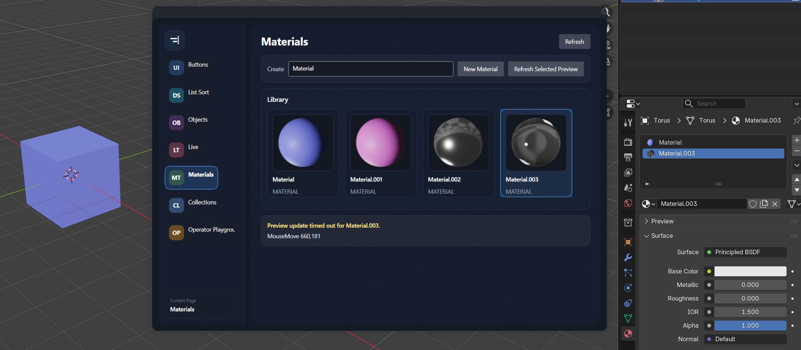
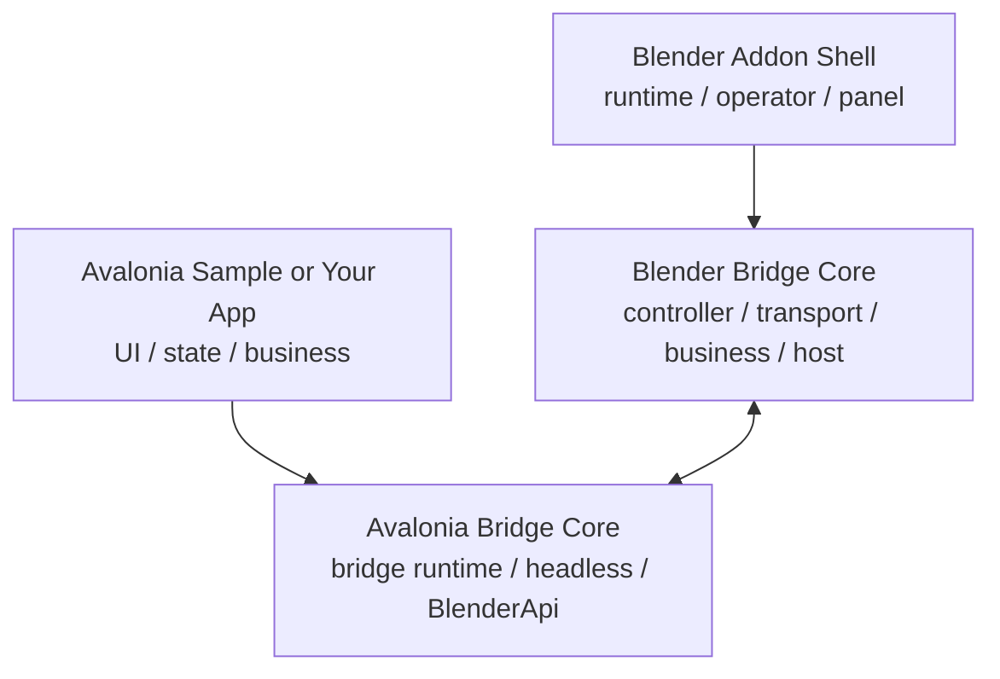

# Blender Avalonia Bridge

## For Humans

Cross-platform toolkit for running an Avalonia UI in a separate process, streaming frames into Blender, and sending Blender input back to Avalonia. Windows and macOS headless shared-memory bridges are supported.



## Documentation

<p>
  <a href="https://atticus-lv.github.io/BlenderAvaloniaBridge/">
    
  </a>
</p>

## License

This project is licensed under the Mozilla Public License 2.0 (`MPL-2.0`).

## Project Composition



This repository is organized into two reusable bridge cores and two application-facing layers.

- `src/blender_extension/avalonia_bridge/core`: Blender bridge core
- `src/blender_extension/avalonia_bridge`: Blender addon shell
- `src/BlenderAvaloniaBridge.Core`: Avalonia bridge core
- `src/BlenderAvaloniaBridge.Sample`: Avalonia sample app

Most integration work happens in the Avalonia app layer and Blender addon layer. The two core layers already handle transport, session, frame, input, and business bridge infrastructure.

## Key Directories

```text
src/BlenderAvaloniaBridge.Core/
src/BlenderAvaloniaBridge.Sample/
src/blender_extension/avalonia_bridge/
src/blender_extension/avalonia_bridge/core/
docs/
tests/
```

## For Agents

Recommended reading order:

1. `docs/en/guide/what-is.md`
2. `docs/en/guide/how-it-works.md`
3. `docs/en/integration/index.md`
4. `docs/en/api/index.md`

Key entry points:

- Avalonia sample entry: `src/BlenderAvaloniaBridge.Sample/Program.cs`
- C# API root: `src/BlenderAvaloniaBridge.Core/BlenderApi.cs`
- Blender bridge controller: `src/blender_extension/avalonia_bridge/core/controller.py`
- Optional View3D host: `src/blender_extension/avalonia_bridge/core/view3d_overlay_host.py`
- Default business endpoint: `src/blender_extension/avalonia_bridge/core/business.py`

Important constraints:

- `headless` uses `frames + input + business`
- `desktop` uses `business` only
- The built-in `BlenderApi` depends on Blender-side compatibility with `rna.*`, `ops.*`, and `watch.*`
- `View3DOverlayHost` is optional host-side composition, not mandatory bridge core
- Blender-side core should stay generic and should not absorb sample-specific business logic

See `AGENTS.md` for a repository-oriented guide.

