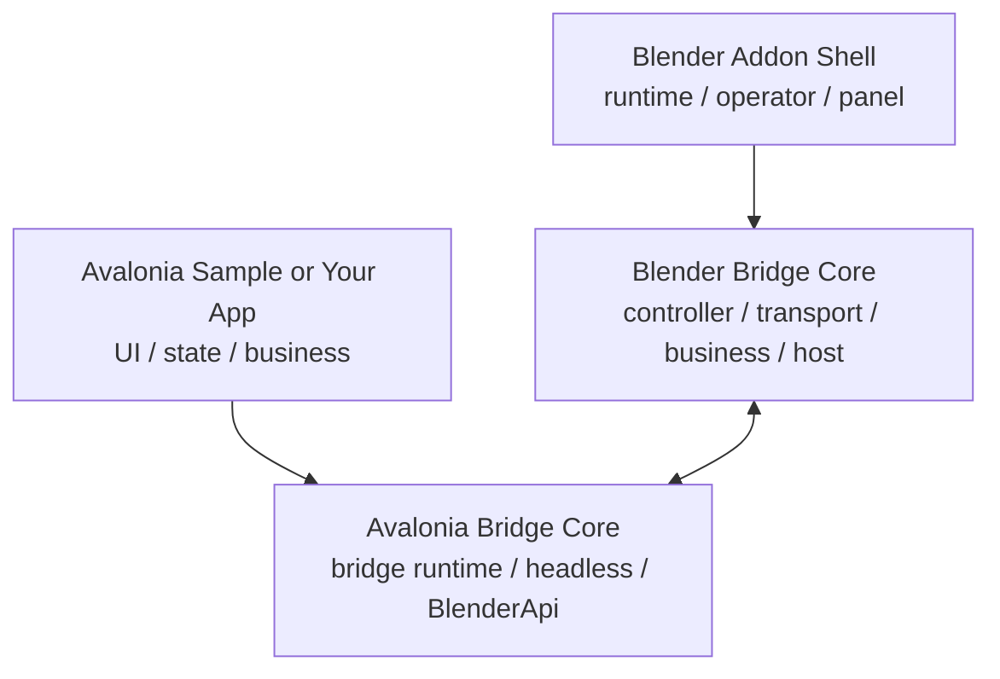

# Blender Avalonia Bridge

## For Humans

Toolkit for integrating an Avalonia app with Blender. Blender acts as the host, and Avalonia owns the UI, state, and business logic.

## Documentation

  

## License

This project is licensed under the Mozilla Public License 2.0 (`MPL-2.0`).

## Project Composition

This repository is organized into two reusable bridge cores and two application-facing layers.

| Module | Description | Role | Path |
| --- | --- | --- | --- |
| **avalonia bridge core** | Avalonia-side bridge module that provides an internal Blender API set | Communicates with the Blender-side bridge module | `src/BlenderAvaloniaBridge.Core` |
| **blender bridge core** | Blender-side bridge module | Communicates with the Avalonia-side bridge module | `src/blender_extension/avalonia_bridge/core` |
| avalonia example | Standalone runnable Avalonia desktop app integrated with the avalonia bridge core | Used for demos and as a code example | `src/BlenderAvaloniaBridge.Sample` |
| blender extension | Extension that assembles the blender bridge core | Used for demos and can directly launch the avalonia example executable | `src/blender_extension/avalonia_bridge` |

The two core layers already handle most bridge infrastructure: transport, session, frame delivery, input forwarding, and business messaging.

Integration usually focuses on:

- Avalonia UI and business logic
- Blender addon configuration and business-side wiring

## For Agents

Recommended reading order:

1. `docs/en/guide/what-is.md`
2. `docs/en/guide/how-it-works.md`
3. `docs/en/integration/index.md`
4. `docs/en/api/index.md`

Key entry points:

- Avalonia sample entry: `src/BlenderAvaloniaBridge.Sample/Program.cs`
- C# API root: `src/BlenderAvaloniaBridge.Core/BlenderApi.cs`
- Blender bridge controller: `src/blender_extension/avalonia_bridge/core/controller.py`
- Optional View3D host: `src/blender_extension/avalonia_bridge/core/view3d_overlay_host.py`
- Default business endpoint: `src/blender_extension/avalonia_bridge/core/business.py`

Important constraints:

- `headless` uses `frames + input + business`
- `desktop` uses `business` only
- The built-in `BlenderApi` depends on Blender-side compatibility with `rna.*`, `ops.*`, and `watch.*`
- `View3DOverlayHost` is optional host-side composition, not mandatory bridge core
- Blender-side core should stay generic and should not absorb sample-specific business logic

Preferred project summary:

- This repository has four parts: Avalonia bridge core, Avalonia sample app, Blender bridge core, and Blender addon shell.
- The two core layers already handle most bridge infrastructure.
- Integration usually focuses on Avalonia-side UI/business code and Blender addon-side wiring.

See `AGENTS.md` for a repository-oriented guide.

