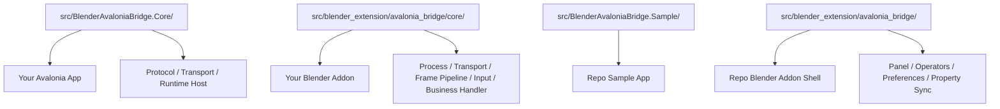
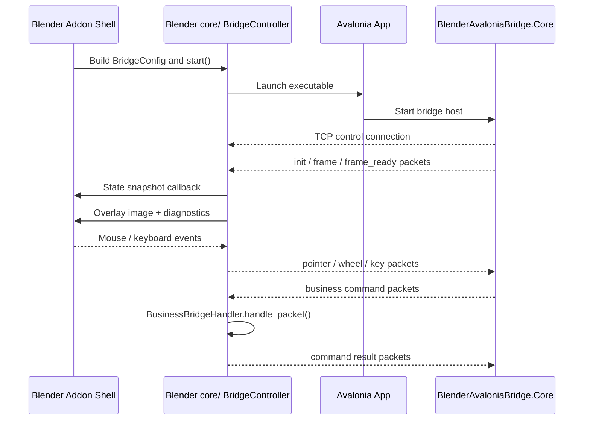

# Architecture Notes

## Responsibilities

- `src/BlenderAvaloniaBridge.Core/`
  - Reusable Avalonia SDK
  - Protocol contracts
  - Transport
  - Headless runtime host
- `src/BlenderAvaloniaBridge.Sample/`
  - Sample app
  - Demo UI
  - Example ViewModels and handlers
- `src/blender_extension/avalonia_bridge/core/`
  - Copyable Blender control layer
  - Process launch
  - Socket transport
  - Shared-memory frame ingestion
  - Overlay input forwarding
  - Default Blender business handler
- `src/blender_extension/avalonia_bridge/`
  - Blender addon shell for this repo
  - Preferences
  - Panel
  - Operators
  - Property-group syncing

## Repository Layers

## Runtime Shape

1. Blender launches the Avalonia executable you configure.
2. Avalonia bridge mode starts a localhost control channel.
3. Avalonia sends frame metadata and frame payloads.
4. Blender receives those frames and draws them as an overlay.
5. Blender forwards pointer and keyboard events back to Avalonia.
6. Business commands such as `collection_get`, `property_get`, `property_set`, and `operator_call` are handled by the Blender-side business handler.

## Runtime Flow

## Recommended Embedding Split

- Your Avalonia app should reference `BlenderAvaloniaBridge.Core`.
- Your Blender addon should copy `src/blender_extension/avalonia_bridge/core/`.
- The two sides keep the same wire protocol and command semantics.

## Customization Points

- Avalonia side:
  - `IBlenderBridgeMessageHost`
  - `IBlenderBridgeStatusSink`
- Blender side:
  - `BridgeController`
  - `BusinessBridgeHandler`
  - `DefaultBusinessBridgeHandler`

## Protocol Summary

- Localhost TCP control channel
- Length-prefixed packets
- JSON headers
- Shared-memory frame path on Windows
- Raw TCP frame payload fallback

## Diagnostics Summary

The Blender addon surfaces diagnostics such as:

- `uptime_s`
- `fps`
- `frame_cadence_ms`
- `last_frame_seq`
- `last_input_type`
- `input_to_next_frame_ms`
- `input_to_apply_ms`
- `capture_to_blender_recv_ms`
- `capture_frame_ms`
- `convert_ms`
- `gpu_upload_ms`
- `overlay_draw_ms`
- `pointer_move_drop_pct`
