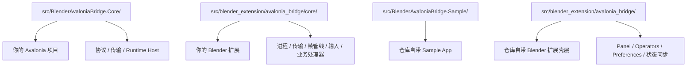
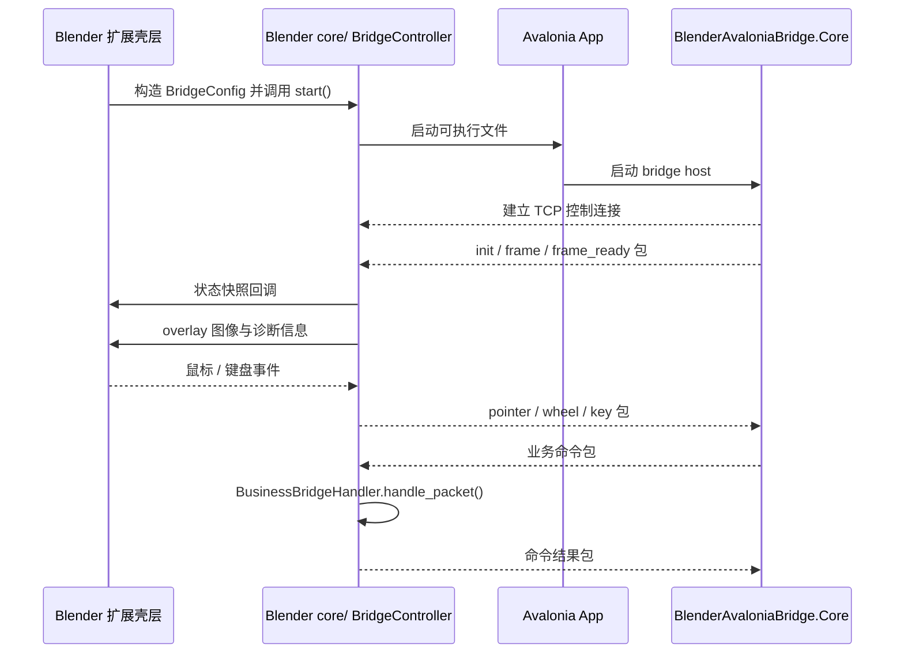

# 架构说明

[English](E:/blender_ava_demo/docs/ARCHITECTURE.md) | 中文

## 职责划分

- `src/BlenderAvaloniaBridge.Core/`
  - 可复用 Avalonia SDK
  - 协议契约
  - 传输层
  - Headless runtime host
- `src/BlenderAvaloniaBridge.Sample/`
  - Sample app
  - Demo UI
  - 示例 ViewModel 与 handler
- `src/blender_extension/avalonia_bridge/core/`
  - 可复制的 Blender 控制层
  - 进程启动
  - Socket 传输
  - 共享内存帧接收
  - Overlay 输入转发
  - 默认 Blender 业务处理器
- `src/blender_extension/avalonia_bridge/`
  - 当前仓库的 Blender 扩展壳层
  - Preferences
  - Panel
  - Operators
  - Property group 同步

## 仓库分层图

## 运行链路

1. Blender 启动你配置的 Avalonia 可执行文件。
2. Avalonia 以 bridge 模式启动 localhost 控制通道。
3. Avalonia 发送帧元数据和帧内容。
4. Blender 接收这些帧并绘制成 overlay。
5. Blender 把鼠标和键盘事件转发回 Avalonia。
6. `collection_get`、`property_get`、`property_set`、`operator_call` 这类业务命令由 Blender 侧业务处理器负责。

## 运行时数据流

## 推荐嵌入方式

- Avalonia 项目引用 `BlenderAvaloniaBridge.Core`
- Blender 扩展复制 `src/blender_extension/avalonia_bridge/core/`
- 两边保持同一套线协议和命令语义

## 可扩展点

- Avalonia 侧：
  - `IBlenderBridgeMessageHost`
  - `IBlenderBridgeStatusSink`
- Blender 侧：
  - `BridgeController`
  - `BusinessBridgeHandler`
  - `DefaultBusinessBridgeHandler`

## 协议摘要

- 本地 TCP 控制通道
- 长度前缀包
- JSON header
- Windows 上默认使用共享内存帧通道
- 保留原始 TCP 帧负载回退路径

## 诊断项摘要

Blender 插件当前展示的诊断项包括：

- `uptime_s`
- `fps`
- `frame_cadence_ms`
- `last_frame_seq`
- `last_input_type`
- `input_to_next_frame_ms`
- `input_to_apply_ms`
- `capture_to_blender_recv_ms`
- `capture_frame_ms`
- `convert_ms`
- `gpu_upload_ms`
- `overlay_draw_ms`
- `pointer_move_drop_pct`
