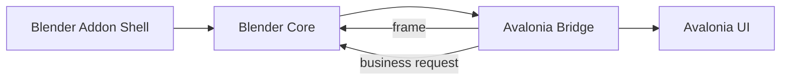
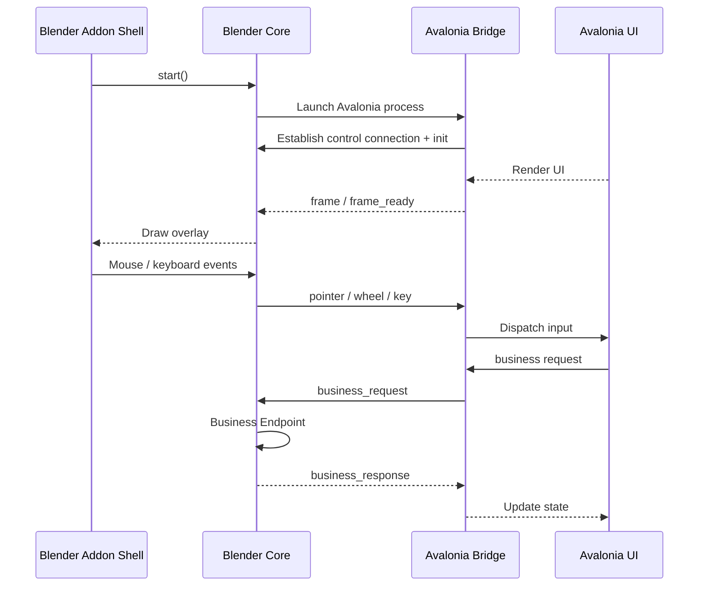

# Architecture

## Overview

- `Blender Addon Shell`: Blender panels, settings, and runtime entry.
- `Blender Core`: process launch, control connection, frame ingestion, input forwarding, and business handling.
- `Avalonia Bridge`: protocol handling, input application, and frame output.
- `Avalonia UI`: interface and state.

## Runtime Flow

## Protocol Summary

- Control channel: localhost TCP
- Packet format: length-prefixed + JSON header
- Frame transport: shared memory on Windows, with TCP payload fallback when needed
