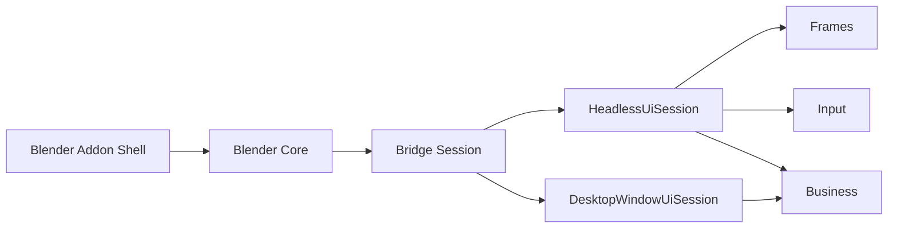
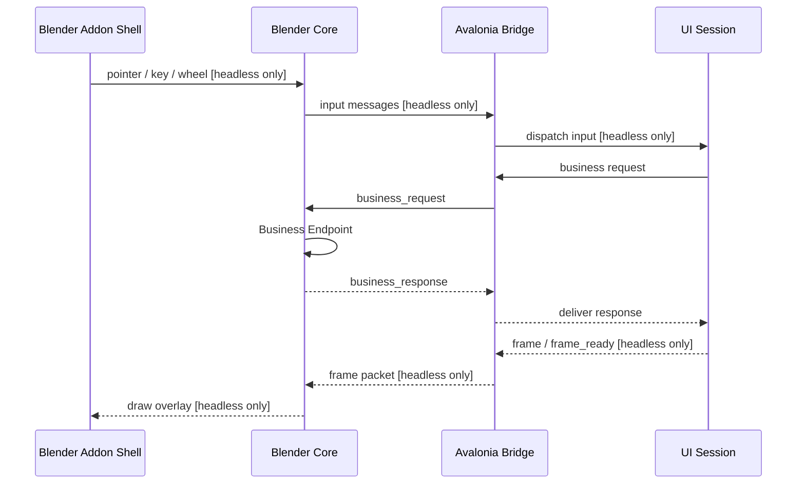

# Architecture

## Overview

- `Blender Addon Shell`: Blender panels, settings, and runtime entry.
- `Blender Core`: process launch, capability negotiation, frame ingestion, optional input forwarding, and business handling.
- `Bridge Session`: the shared transport/session layer that owns connection lifecycle, request/response routing, and capability-aware dispatch.
- `HeadlessUiSession`: Avalonia headless host with `frames + input + business`.
- `DesktopWindowUiSession`: real Avalonia desktop window host with `business` only.

Business transport is now a first-class capability of the bridge session, not something implicitly tied to headless frame streaming.

## C# API layout

On the Avalonia side, the default business surface is now rooted at `BlenderApi`:

- `BlenderApi.Rna`: path-oriented RNA access and RNA method calls
- `BlenderApi.Ops`: operator poll and call flows
- `BlenderApi.Observe`: watch subscription, `watch.dirty` follow-up, and snapshot reads

This is an API-surface refactor only. The built-in business protocol names stay unchanged as `rna.*`, `ops.*`, and `watch.*`.

`Data` is intentionally reserved for a future resource-oriented domain and is not exposed yet.

## Runtime Flow

The same session model supports both runtime modes:

- `headless`: enables `frames + input + business`
- `desktop-business`: enables `business` only, so the frame and input branches above are skipped by capability negotiation

## Protocol Summary

- Control channel: localhost TCP
- Packet format: length-prefixed + JSON header
- Init handshake includes capability fields such as `window_mode`, `supports_business`, `supports_frames`, and `supports_input`
- Frame transport: shared memory on Windows and macOS in headless mode, while the existing TCP frame packet path remains available as a compatibility fallback when no shared-memory handle is supplied
