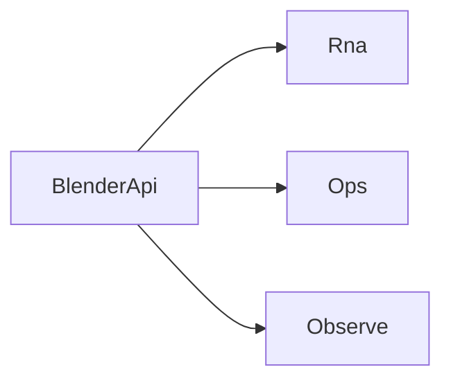

# BlenderApi

`BlenderApi` is the root C# entry point for business calls from Avalonia to Blender.

- `blenderApi.Rna` for RNA path listing, reads, writes, descriptions, and RNA method calls
- `blenderApi.Ops` for Blender operator polling and execution
- `blenderApi.Observe` for watch subscriptions and snapshot reads

## Read By Task

- Need to browse or edit Blender state by path: go to [RNA](./rna.md)
- Need to call Blender operators: go to [Ops](./ops.md)
- Need change notifications or watch snapshots: go to [Observe](./observe.md)
- Need shared request and value types: go to [Types](./types.md)

## Usage Pattern

1. Use `blenderApi.Rna` to list or read the objects your UI needs.
2. Use `blenderApi.Ops` when the action maps to a Blender operator.
3. Use `blenderApi.Observe` to subscribe to changes and refresh affected paths.

For integration, see [Integration Overview](../integration/index.md).
