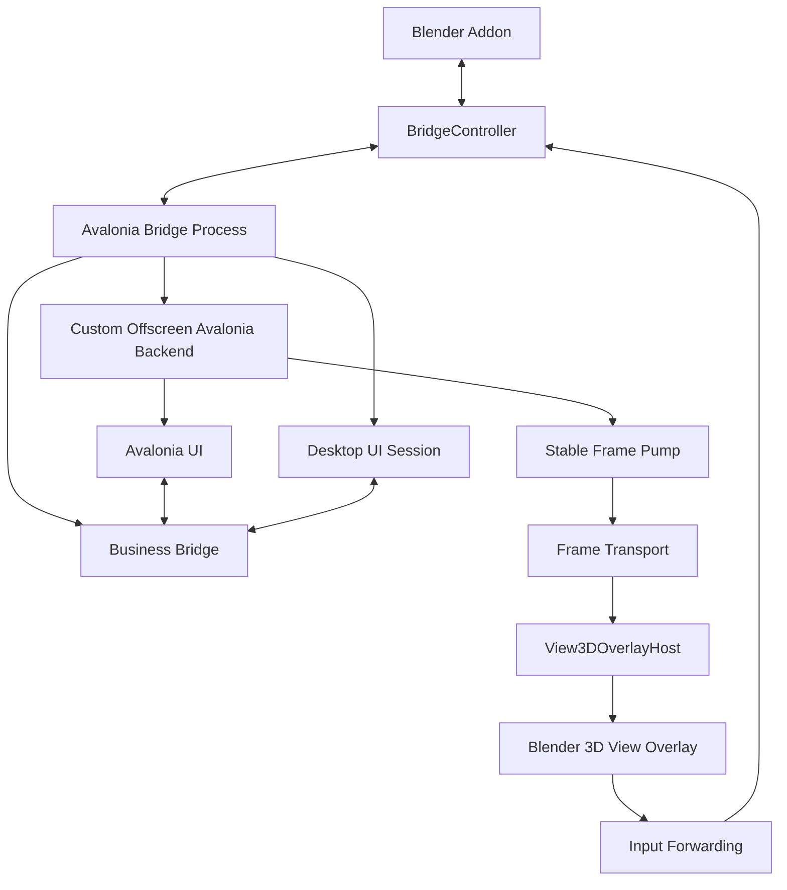
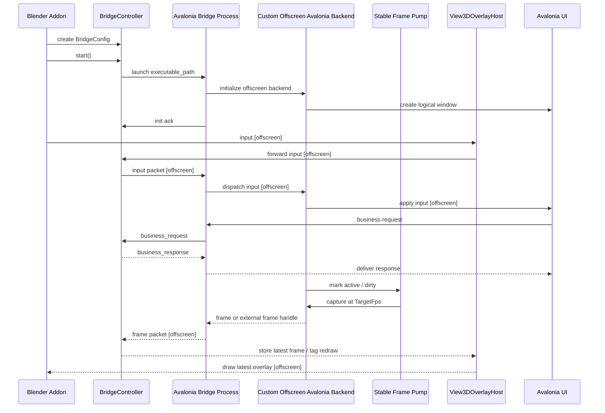

# How It Works

## Overall structure

## Runtime flow

## Offscreen frame flow

In offscreen mode, the bridge process owns a custom Avalonia backend instead of a desktop window. The backend creates the logical Avalonia window, dispatches input, and feeds a stable frame pump. Input and UI invalidation mark the UI as active, but Blender does not request frames faster than the configured cadence.

The current startup value for this mode is still `window_mode="headless"` for compatibility.

Frame flow:

1. Avalonia applies input or business state.
2. The bridge frame pump publishes frames at `TargetFps` while the UI is active.
3. Blender receives frame metadata or pixels on a background socket thread.
4. Blender stores only the latest frame.
5. `View3DOverlayHost.tick_once()` presents the latest frame during the modal timer.

On macOS, the preferred path uses IOSurface metadata and a Blender-side Metal texture copy. Shared memory and inline frame payloads remain fallback paths.

## Sizing

- `width` and `height` are Avalonia logical window dimensions.
- `render_scaling` controls render density and the Blender overlay display scale in offscreen mode.
- Input coordinates are mapped back to the logical `width` and `height`.
- If the `3D View` area is smaller than the requested overlay size, the overlay is fitted into the available region.
