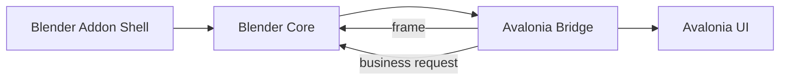
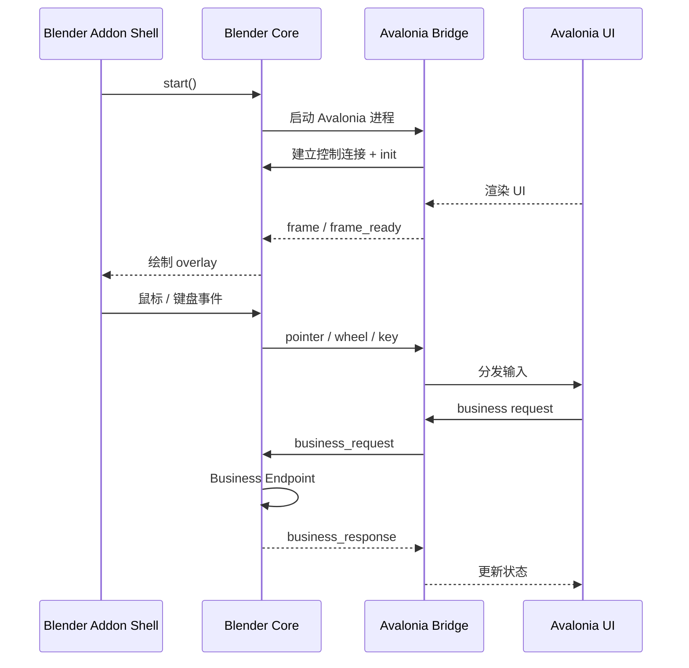

# 项目架构

## 整体架构

- `Blender Addon Shell`：Blender 面板、配置和运行入口。
- `Blender Core`：负责进程启动、控制连接、帧接收、输入转发和业务处理。
- `Avalonia Bridge`：负责协议处理、输入应用和帧输出。
- `Avalonia UI`：负责界面和状态。

## 运行时数据流

## 协议摘要

- 控制通道：localhost TCP
- 包格式：长度前缀 + JSON header
- 帧传输：Windows 默认共享内存，必要时回退到 TCP payload
