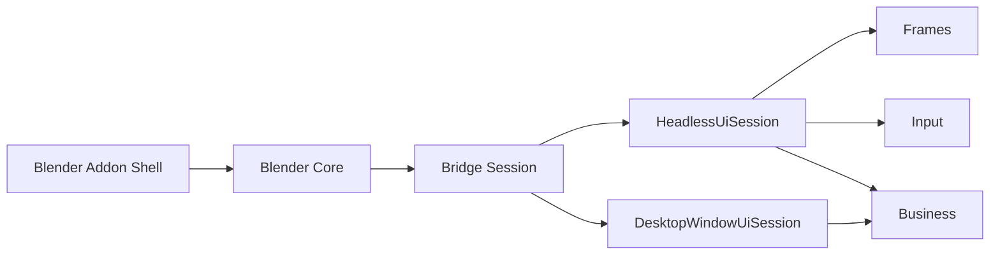
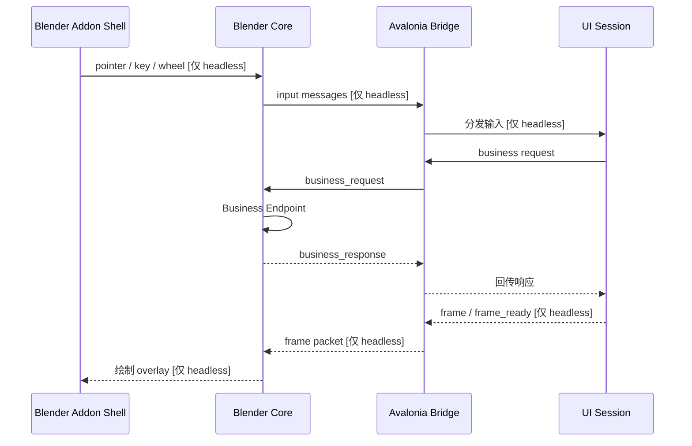

# 项目架构

## 整体架构

- `Blender Addon Shell`：Blender 面板、配置和运行入口。
- `Blender Core`：负责进程启动、能力协商、帧接收、可选输入转发和业务处理。
- `Bridge Session`：共享的连接/会话层，负责连接生命周期、请求响应分发和基于 capability 的调度。
- `HeadlessUiSession`：Avalonia 无头宿主，会启用 `frames + input + business`。
- `DesktopWindowUiSession`：真实 Avalonia 桌面窗口宿主，只启用 `business`。

现在 business 传输已经是 bridge session 的独立能力，不再隐式依赖 headless 帧流。

## C# API 分层

在 Avalonia 侧，默认 business 能力现在统一挂在 `BlenderApi` 根对象下：

- `BlenderApi.Rna`：面向路径的 RNA 访问和 RNA 方法调用
- `BlenderApi.Ops`：operator 的 poll 与调用
- `BlenderApi.Observe`：watch 订阅、`watch.dirty` 后续处理和快照读取

这次调整只重构了 C# API 形状，底层业务协议名仍然保持 `rna.*`、`ops.*`、`watch.*` 不变。

`Data` 会为后续资源型能力预留，但当前版本不会先暴露出来。

## 运行时数据流

同一套 session 模型支持两种运行模式：

- `headless`：启用 `frames + input + business`
- `desktop-business`：只启用 `business`，因此上图里的帧分支和输入分支都会在 capability 协商后被跳过

## 协议摘要

- 控制通道：localhost TCP
- 包格式：长度前缀 + JSON header
- `init` 握手会携带 `window_mode`、`supports_business`、`supports_frames`、`supports_input` 等 capability 字段
- 帧传输：在 headless 模式下，Windows 和 macOS 默认通过共享内存传输帧；如果握手里没有可用的共享内存句柄，则保留现有 TCP frame packet 作为兼容回退路径
