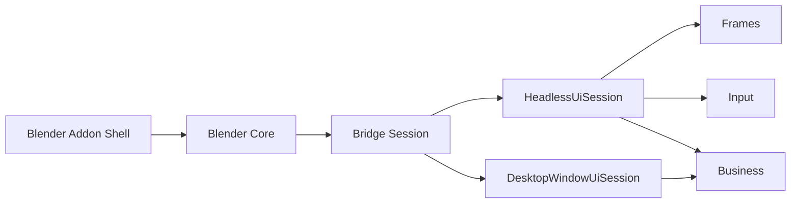
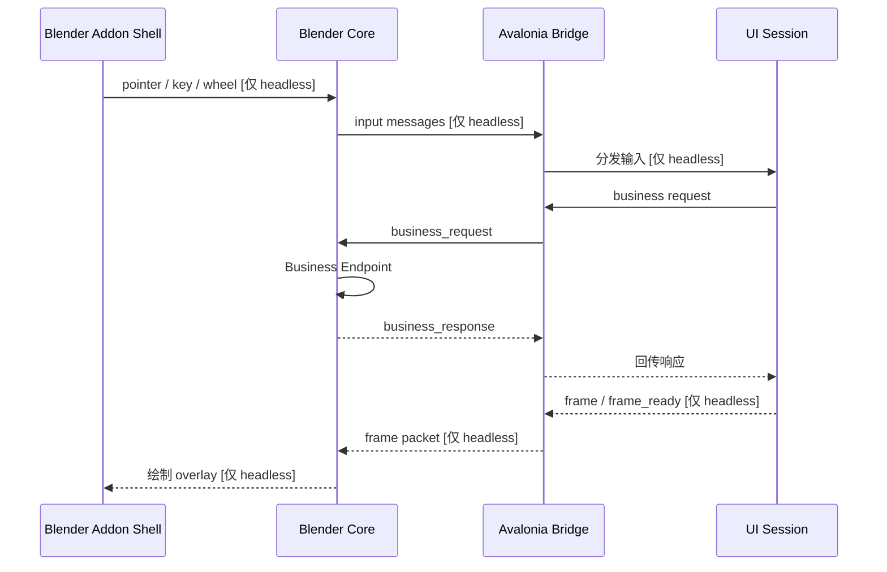

# 项目架构

## 整体架构

- `Blender Addon Shell`：Blender 面板、配置和运行入口。
- `Blender Core`：负责进程启动、能力协商、帧接收、可选输入转发和业务处理。
- `Bridge Session`：共享的连接/会话层，负责连接生命周期、请求响应分发和基于 capability 的调度。
- `HeadlessUiSession`：Avalonia 无头宿主，会启用 `frames + input + business`。
- `DesktopWindowUiSession`：真实 Avalonia 桌面窗口宿主，只启用 `business`。

现在 business 传输已经是 bridge session 的独立能力，不再隐式依赖 headless 帧流。

## 运行时数据流

同一套 session 模型支持两种运行模式：

- `headless`：启用 `frames + input + business`
- `desktop-business`：只启用 `business`，因此上图里的帧分支和输入分支都会在 capability 协商后被跳过

## 协议摘要

- 控制通道：localhost TCP
- 包格式：长度前缀 + JSON header
- `init` 握手会携带 `window_mode`、`supports_business`、`supports_frames`、`supports_input` 等 capability 字段
- 帧传输：当启用 frame transport 时，Windows 默认共享内存，必要时回退到 TCP payload
