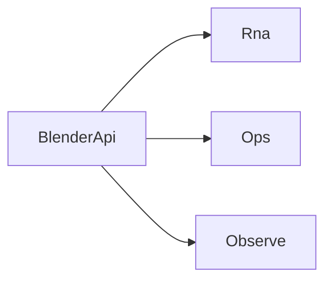

# BlenderApi

`BlenderApi` 是 Avalonia 到 Blender 的 C# 业务调用根入口。

- `blenderApi.Rna`：RNA 路径列举、读写、描述与 RNA 方法调用
- `blenderApi.Ops`：Blender operator 的 poll 与执行
- `blenderApi.Observe`：watch 订阅与快照读取

## 按任务阅读

- 需要按路径浏览或修改 Blender 状态：看 [RNA](./rna.md)
- 需要调用 Blender operator：看 [Ops](./ops.md)
- 需要变更通知或 watch 快照：看 [Observe](./observe.md)
- 需要了解共享请求类型和值模型：看 [Types](./types.md)

## 常见使用方式

1. 先用 `blenderApi.Rna` 列表或读取 UI 需要的数据。
2. 遇到动作型能力时，用 `blenderApi.Ops` 调 Blender operator。
3. 需要响应 Blender 侧变化时，用 `blenderApi.Observe` 建 watch 并刷新相关路径。

接入方式请看[集成概览](../integration/index.md)。
