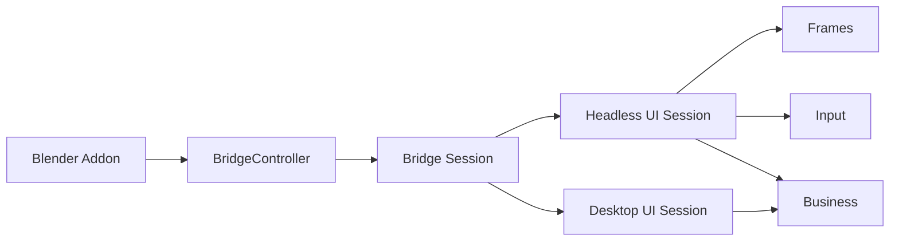
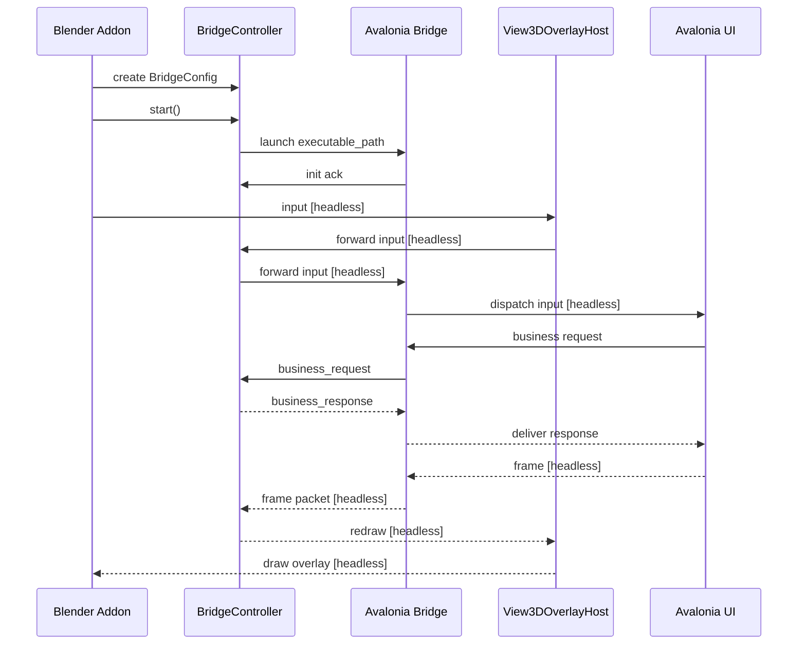

# 工作原理

## 整体结构

```mermaid
flowchart LR
    A["Blender Addon"] --> B["BridgeController"]
    B --> C["Bridge Session"]

    C --> D["Headless UI Session"]
    C --> E["Desktop UI Session"]

    D --> F["Frames"]
    D --> G["Input"]
    D --> H["Business"]

    E --> H
```

## 运行时链路

```mermaid
sequenceDiagram
    participant Blender as Blender Addon
    participant Core as BridgeController
    participant Bridge as Avalonia Bridge
    participant Host as View3DOverlayHost
    participant UI as Avalonia UI

    Blender->>Core: create BridgeConfig
    Blender->>Core: start()
    Core->>Bridge: launch executable_path
    Bridge->>Core: init ack

    Blender->>Host: input [headless]
    Host->>Core: forward input [headless]
    Core->>Bridge: forward input [headless]
    Bridge->>UI: dispatch input [headless]

    UI->>Bridge: business request
    Bridge->>Core: business_request
    Core-->>Bridge: business_response
    Bridge-->>UI: deliver response

    UI-->>Bridge: frame [headless]
    Bridge-->>Core: frame packet [headless]
    Core-->>Host: redraw [headless]
    Host-->>Blender: draw overlay [headless]
```
