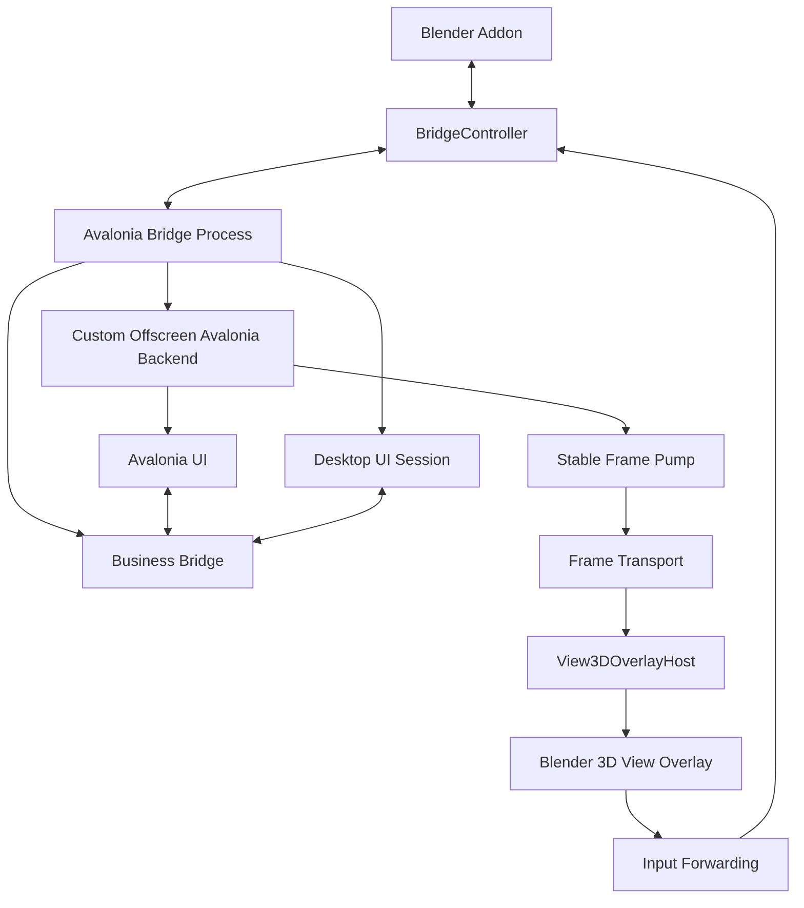
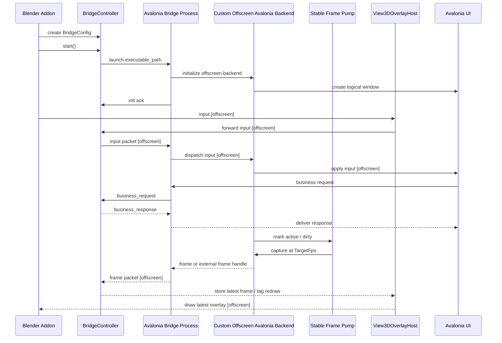

# 工作原理

## 整体结构

## 运行时链路

## Offscreen frame 链路

在 offscreen 模式下，bridge 进程使用自定义 Avalonia backend，而不是桌面窗口。这个 backend 负责创建 Avalonia 逻辑窗口、派发输入，并把内容交给稳定 frame pump。输入和 UI invalidation 只会把 UI 标记为活跃，Blender 不会反向请求更高帧率。

当前启动配置值仍保留为 `window_mode="headless"`，用于兼容已有集成。

Frame 链路：

1. Avalonia 应用输入或业务状态。
2. UI 活跃期间，bridge frame pump 按 `TargetFps` 发布 frame。
3. Blender 在后台 socket 线程接收 frame metadata 或像素数据。
4. Blender 只保存最新 frame。
5. `View3DOverlayHost.tick_once()` 在 modal timer 中展示最新 frame。

macOS 上优先使用 IOSurface metadata 和 Blender 侧 Metal texture copy。Shared memory 和 inline frame payload 仍作为 fallback 路径。

## 尺寸语义

- `width` 和 `height` 是 Avalonia 逻辑窗口尺寸。
- `render_scaling` 在 offscreen 模式下同时控制渲染密度和 Blender overlay 的显示倍率。
- 输入坐标会映射回逻辑 `width` 和 `height`。
- 如果 `3D View` 区域小于请求的 overlay 尺寸，overlay 会适配到可用区域内。
